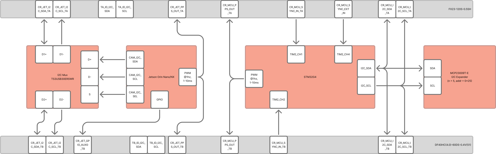

## What It Does

Cerebrum is the RedBrain baseboard. It hosts the Jetson Orin compute module and provides power distribution, expansion, and system orchestration for Thalamus and Axon modules.

## Key Specs

| Item | Value |
|---|---|
| Supported compute modules | Jetson Orin Nano, Jetson Orin NX |
| Board size | 90 mm x 90 mm |
| Input power | 12 V nominal (integration profile dependent) |
| Operating range | -40 C to +85 C (board-level target) |
| Extension interfaces | Thalamus A (120-pin), Thalamus B (dual 60-pin) |

## Main Interfaces

- USB-C device port for recovery/flash workflows
- USB-C host for peripherals
- Console USB-UART access
- Gigabit Ethernet
- M.2 storage and expansion slots
- CAN-FD buses (main and auxiliary)

## Power and Indicators

- Main system power LED
- Rail and status indicators
- RGB status indication controlled by onboard MCU

## Mechanical Notes

- Keep heatsink/fan airflow clear above Jetson.
- Maintain access to debug/recovery points for bring-up.
- Secure external harnessing before vibration or field trials.

## Related References

- [Connector and pinout summary](/reference/connectors/)
- [Consolidated hardware specifications](/reference/specifications/)
