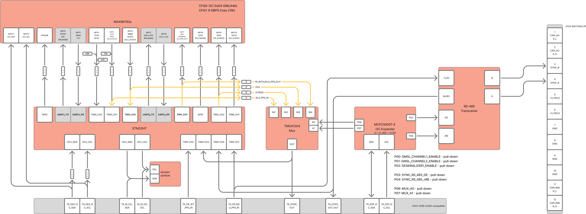

## What It Does

Thalamus A is the primary extension board for front-facing perception and field bus breakout. It handles GMSL deserialization, camera channel control, CAN-FD routing, and sync distribution.

## Key Specs

| Item | Value |
|---|---|
| Camera channels | 2x GMSL links |
| MCU | STM32H7 class control MCU |
| Bus interfaces | CAN_MAIN, CAN_AUX, RS-485 sync lines |
| External connectors | 2x 12-pin CAN/SYNC daisy-chain connectors |
| Operating range | -40 C to +85 C (board-level target) |

## Interface Highlights

- Independent per-channel camera power control
- Shared camera control bus support
- USB high-speed device link back to Jetson domain
- Board ID/calibration storage path

## Integration Tips

- Use Thalamus A when you need robust field CAN and sync handoff.
- Put stereo camera pairs on links 0 and 1 for predictable VSLAM pipelines.
- Enable terminators only at physical bus ends.

## Pinout Reference

Detailed CAN/SYNC and mezzanine pinouts are in [Connectors Reference](/reference/connectors/).
