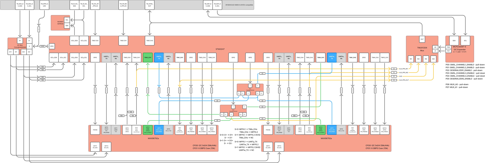

## What It Does

Thalamus B expands RedBrain camera capacity with four additional GMSL channels and associated control logic, while staying synchronized with the system timing plane.

## Key Specs

| Item | Value |
|---|---|
| Camera channels | 4x GMSL links |
| MCU | STM32H7 class control MCU |
| Backplane | Dual 60-pin mezzanine connectors |
| Channel control | Individual power control per camera link |
| Operating range | -40 C to +85 C (board-level target) |

## Integration Guidance

- Use Thalamus B for surround vision and multi-view capture.
- Keep link naming stable in config (`links."0"` to `links."3"`) to simplify swaps.
- Keep cable lengths and routing consistent across stereo or matched camera pairs.

## Mounting and Serviceability

- Maintain clearance for both mezzanine connectors.
- Verify no interference with installed M.2 modules on Cerebrum.
- Label coax runs to keep troubleshooting time low.

## Pinout Reference

See [Connectors Reference](/reference/connectors/) for connector and signal summaries.
