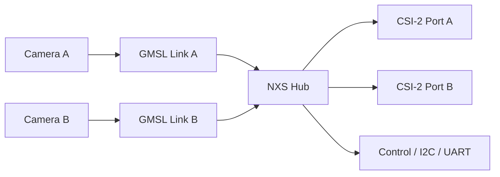

*Aliensense · Version v1.2 · 2026-08-18*

## Overview

The NXS Hub is a compact GMSL3/2 deserialization interface designed to receive two camera links and present them as dual MIPI CSI-2 outputs for downstream processing. It is intended for embedded vision systems that need a robust, compact bridge between remote camera modules and a host processor.

Built around the Maxim MAX96792 deserializer, the board combines high-speed video routing, power management, control interfaces, and protection features in a single module. Its architecture supports dual-camera use cases while preserving clear, modular integration paths for host-side control and configuration.

## Key Features

- Dual GMSL3/2 input support for two independent camera links
- Dual MIPI CSI-2 output paths for downstream host connectivity
- 12 V input architecture with regulated 3.3 V, 1.8 V, 1.2 V, and 1.0 V rails
- Independent power switching for each GMSL channel
- Flexible control routing through UART, trigger, reset, and enable lines
- I2C translation and bus switching for system-level integration
- Integrated ESD protection and automotive-qualified power switching elements

## Functional Summary

The NXS Hub receives video and control signals from remote camera modules over GMSL links, deserializes the streams, and presents them as CSI-2 outputs through a mezzanine interface and a flat-flex connector. The board also provides a control interface for reset, enable, trigger, and configuration signals, enabling system integration without requiring a separate control companion board.

## System Architecture

## Interfaces

| Interface | Description |
|---|---|
| GMSL3/2 input | Two independent GMSL3/2 input channels |
| CSI-2 output | Dual CSI-2 output paths with clock and data lanes |
| I2C | Deserializer and host-side control bus support |
| UART / control | Reset, trigger, enable, and external control support |
| Power | 12 V primary input with distributed rail generation |

## Key Components

| Component | Function |
|---|---|
| MAX96792AGTM | Core GMSL3/2 deserializer |

## Connectors

| Connector | Function |
|---|---|
| Mezzanine power connector | 12 V power delivery |
| Mezzanine signal connector | CSI-2 Port B and control signals |
| FFC connector | CSI-2 Port A and I2C/control access |
| GMSL connectors | Two input links for remote camera connections |
| External control connectors | External UART and trigger support |

## Electrical Summary

| Parameter | Summary |
|---|---|
| Primary input voltage range | 4.7-17 V DC |
| GMSL video stream operating voltage range  | 7-17 V DC |
| Regulated rails | 3.3 V, 1.8 V, 1.2 V, 1.0 V |
| Interface types | GMSL3/2, CSI-2, I2C, UART, control GPIO |
| Protection | ESD protection on high-speed lanes and control pins |

## Notes

This document is based on the reference netlist and interface analysis for the NXS Hub. Final validation should be aligned with the latest schematic, layout, and firmware integration documentation.

## Documentation

- [Brochure](../product-description/) — positioning overview
- [Datasheet](../datasheet/) — full ratings, interfaces, connectors and pinouts, mechanical
