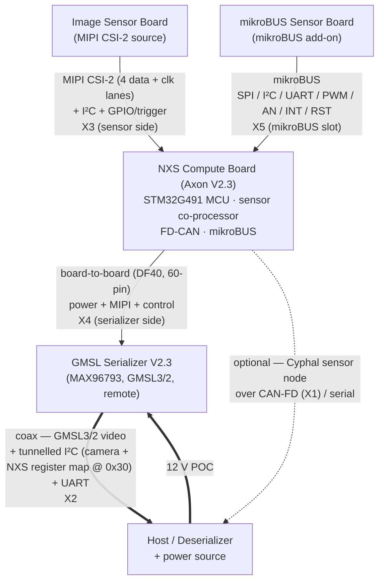
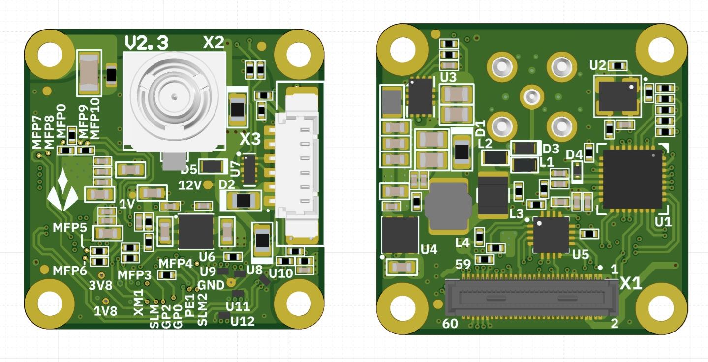
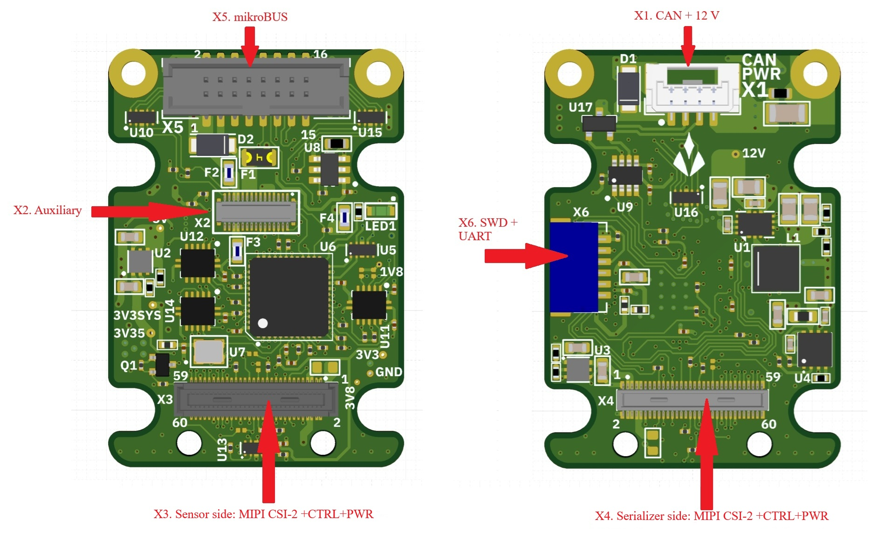
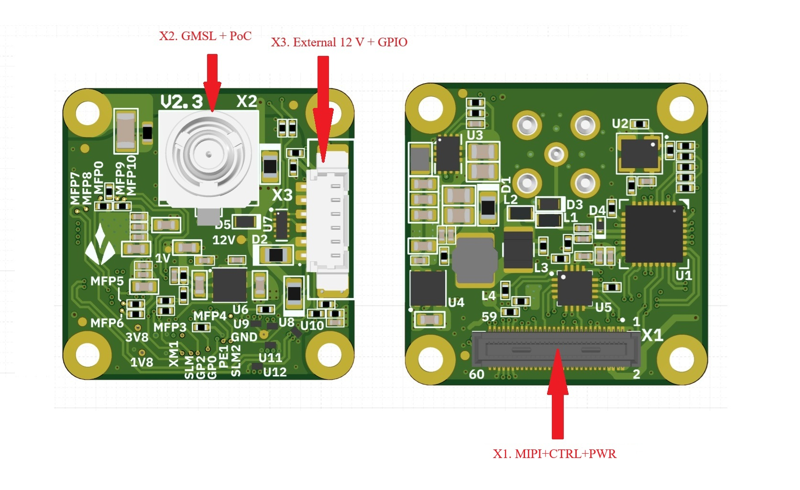

| Field | Value |
| :--- | :--- |
| **Product** | NXS — GMSL camera + smart-sensor node (assembly name: **Nexus**) |
| **Document** | Datasheet (integrator / hardware-engineer level) |
| **Revision** | v0.10 |
| **Date** | 2026-08-18 |
| **Boards covered** | NXS compute board (Axon V2.3), GMSL Serializer V2.3 |

***

## 1. Features

* Serializes a **MIPI CSI-2** camera over a single coaxial cable using **GMSL3/2** with **Power-over-Coax (POC)**.
* Field-programmable **smart-sensor co-processor** — acquires generic sensors and reports their **measurements in physical SI units**.
* **I²C register map tunnelled through the GMSL link** — a sensor added inline rides the same coax as the video, with no extra bus or cabling and no Cyphal required.
* Standard **Cyphal** node over CAN-FD or serial for networked, multi-node access.
* Field-updatable over either host path; multiple nodes coexist on one bus.
* Two-board assembly (**Nexus**): NXS compute board (Axon V2.3) + remote GMSL Serializer V2.3.
* **mikroBUS** expansion socket for an optional add-on sensor board.

**NXS compute board (Axon V2.3):**

* STM32G491CEU6 MCU (Cortex-M4F, 160 MHz) running the NXS sensor co-processor (§7).
* FD-CAN transceiver — Cyphal/CAN-FD node, multi-node capable.
* I²C target register map (7-bit address `0x30`), reachable directly or tunnelled over the GMSL control channel.
* mikroBUS socket (SPI / I²C / UART / PWM / AN / INT / RST).
* SWD + UART header; host UART for the Cyphal/serial link.
* Green status LED — glance-readable firmware-state ladder and host-triggered identify strobe (§7.7).

**GMSL Serializer V2.3:**

* MAX96793 GMSL3/2 CSI-2 serializer (MIPI → coax).
* FAKRA-type coax output connector.

## 2. Applications

* Move an existing MIPI camera to GMSL distance — up to 15 m from compute over a single coax, with power on the same cable.
* Sensor cable runs past USB's 5 m wall (robot arms, AGVs, chassis-length runs).
* Heterogeneous sensor mixes (IMU + distance + environmental + camera) on one integration path.
* Camera + sensor over a single coax (GMSL with Power-over-Coax).
* Distributed sensor networks across a structure (CAN-FD, multi-node).

Typical domains: robotics, autonomous vehicles, industrial automation, research platforms.

## 3. Description

**NXS** is a compact node for coax-connected robotics that performs two functions at once: it **serializes a camera** — a **MIPI CSI-2** image stream carried over a single coaxial cable using **GMSL3/2** with **Power-over-Coax (POC)** — and it runs a field-programmable **smart-sensor co-processor** that acquires generic sensors and reports their **measurements in physical SI units**. Because the compute board sits **inline between the camera and the serializer**, a sensor added there rides back to the host over the **same coax as the video** — read from an **I²C register map tunnelled through the GMSL link**, with no extra bus or cabling and no Cyphal required. The same measurements are also available as a standard **Cyphal** node over CAN-FD or serial, for hosts that want networked, multi-node access.

NXS ships as a two-board assembly — officially, **Nexus** — comprising the **NXS compute board** (STM32-based carrier, hardware rev *Axon V2.3*) and the remote **GMSL Serializer V2.3**. The NXS compute board interfaces the image sensor over MIPI CSI-2 and routes the stream, together with control and power, to the serializer; on the same board an STM32G491 MCU runs the sensor co-processor. The compute board also hosts a **mikroBUS** expansion socket for an optional add-on sensor board.

**Functional summary:**

* **Image Sensor Board** — External MIPI CSI-2 image source. Connects to the NXS sensor-side connector (X3) and provides the camera data lanes (2 or 4 × data + clock), I²C control/configuration, and GPIO/trigger signals. Powered and controlled from the NXS compute board.
* **mikroBUS Sensor Board** — Optional add-on module in the NXS mikroBUS socket (X5). Any board built to the mikroBUS socket standard fits — SPI (SCK/SDI/SDO/CS), I²C (SDA/SCL), UART (RX/TX), PWM, AN, INT, RST — powered from the compute board's 5VEXT and fused 3V3SYS rails. Sensor drivers (§7.5) drive the attached board over the socket's I²C/SPI/UART/AN/PWM signals — MikroElektronika Click boards are the natural fit.
* **NXS Compute Board (Axon V2.3)** — Control & carrier board. Hosts the **STM32G491CEU6** MCU running the sensor co-processor firmware (§7), an FD-CAN interface, a **mikroBUS** expansion socket, and board-to-board connectors carrying MIPI CSI-2, I²C, control GPIO and power between the image sensor and the serializer.
* **GMSL Serializer V2.3** — Remote camera-side board. Hosts the **MAX96793** GMSL3/2 serializer that converts MIPI CSI-2 to a single coax link, with the coaxial output carrying Power-over-Coax.

**Key roles:**

| Function | Image Sensor Board | mikroBUS Sensor Board | NXS Compute Board | GMSL Serializer V2.3 |
| :--- | :--- | :--- | :--- | :--- |
| MIPI CSI-2 handling | Source (camera output) | — | Routes lanes (X3 → X4) | Serializes to GMSL3/2 coax |
| Sensor stream / compute | — | Sensor front-end | Runs on-device driver VM; sample readout over I²C register map (GMSL tunnel) or Cyphal (CAN-FD / serial) | Tunnels host I²C/UART over coax |
| External comms | — | mikroBUS (X5) | FD-CAN, host UART, I²C target, mikroBUS, SWD | I²C/UART config via coax link |
| Power origin | Supplied by NXS | Supplied by NXS | 12 V input (connector) | 12 V via POC or external |

The two functions are independent: the video path is hardware serialization (X3 → X4 → coax) plus the MAX96793, while the sensor co-processor is firmware on the STM32 driving the mikroBUS/onboard sensors. A unit may be deployed for video only, sensors only, or both.

**Two ways to reach the sensor.** An integrator who only wants to add a sensor to an existing GMSL camera link uses the **I²C register map over the GMSL tunnel** — samples, parameters, driver store, commissioning, and firmware update all work over that single path, with no CAN bus, no serial cable, and no Cyphal. An integrator building a sensor network adds **Cyphal** over CAN-FD or serial for the standard SI subjects, multi-node addressing, and stock OpenCyphal tooling. The two are not exclusive: the same device serves both at once, and either can be ignored.

**Device Information:**

| Field | Value |
| :--- | :--- |
| Product | NXS (assembly name: Nexus) |
| Boards | NXS compute board (Axon V2.3) · GMSL Serializer V2.3 |
| Dimensions (W × H × D) | 30 × 40 × 28 mm |
| Weight | 21 g |

***

## 4. Electrical Characteristics

### 4.1 Absolute Maximum Ratings (cited)

**NXS compute board (Axon V2.3):**

| Parameter | Min | Max | Unit |
|---|---|---|---|
| Primary supply voltage (`12V`) | 4.7| 16 | V |
| Digital I/O voltage (MikroBus and UART domain) | -0.3 | 4 | V |
| Digital I/O voltage (Image sensors domain) | -0.3 | 2.0 | V |
| Digital I/O voltage (CAN domain) | -0.3 | 6 | V |
| ESD (human-body model, connectors) | ±2 | — | kV |
| Operating temperature | −40 | +105 | °C |
| Storage temperature | −40 | +125 | °C |

**GMSL Serializer V2.3:**

| Parameter | Min | Max | Unit |
|---|---|---|---|
| Primary supply voltage (`12V`) | 4.7| 16 | V |
| Digital I/O voltage  | -0.3 | 2.0 | V |
| ESD (human-body model, connectors) | ±2 | — | kV |
| Operating temperature | −40 | +105 | °C |
| Storage temperature | −40 | +125 | °C |

### 4.2 Recommended Operating Conditions

Both boards:

| Parameter | Min | Typ | Max | Notes |
| :--- | :--- | :--- | :--- | :--- |
| 12 V input | 4.7 | 12.0 | 16 | — |
| Operating temp (system) | −40 | — | +85 | Industrial grade |

***

## 5. NXS Compute Board (Axon V2.3)

The NXS compute board is the system control and carrier board. An **STM32G491CEU6** ARM Cortex-M4F MCU (160 MHz) runs the sensor co-processor firmware (§7) and manages the system, communicating over **FD-CAN**, a **host UART** (Cyphal/serial), an **I²C target** (register map), **SWD/debug-UART**, and a **mikroBUS** expansion socket. The board provides a multi-stage power tree, 1.8 V↔3.3 V level translation for the sensor/serializer control domain, and high-density board-to-board connectors that pass MIPI CSI-2, I²C, control GPIO, and power to/from the serializer side.

***

## 6. GMSL Serializer V2.3

The GMSL Serializer V2.3 is the remote, camera-side board. A **MAX96793** GMSL3/2 serializer accepts the MIPI CSI-2 stream and transmits it over a single coaxial cable, while the same coax delivers **Power-over-Coax (POC)** to power the board. The coax control channel also tunnels the host I²C/UART used to configure the sensor and serializer.

**Power-over-Coax (POC).** The coax connector (X2) carries both the GMSL high-speed signal and the 12 V supply. This allows the remote board to be powered entirely over the single coax cable.

***

## 7. Sensor Co-Processor & Host Interface

The STM32 on the NXS compute board runs a **smart-sensor co-processor**: it acquires a sensor (the mikroBUS add-on or an onboard I²C/SPI part), converts the raw data to physical **SI units** on-device, and reports the result to a host. It is reachable **two ways** from one firmware image: an **I²C register map** — the low-friction path that rides the GMSL I²C tunnel over the existing coax, needing no additional bus — and a standards-compliant **Cyphal** node over CAN-FD or serial, decodable by stock OpenCyphal tooling. It is **field-updatable** over either, and supports **multiple nodes on one bus**.

This chapter is an overview. The normative contract — registers, commands, wire formats, procedures — is the released specification set on the [documentation site](../../): the [Interface Description](../../reference/nxs-host-interface/), the [Integration & Operation Manual](../../reference/nxs-integration-manual/), and the [Driver Development Guide](../../reference/nxs-driver-development/).

### 7.1 Device model

A sensor driver is not compiled into the firmware. It is authored on the host as a small program, compiled to a portable **NXS image** (bytecode plus capability descriptors), and uploaded to the device, where an on-device virtual machine probes the sensor, configures it, and produces fixed-size samples. The host reads samples, sets parameters, manages a persistent driver store, commissions the node's network identity, and updates firmware — over any transport, with identical semantics.

* **Self-describing output.** Each driver declares, per output field, a name, numeric type, byte order, scale, offset, unit string, and semantic category (e.g. `accel_x`, `pressure`). These descriptors travel inside the image and are readable back from the device, so a host decodes a sample to SI without holding the driver file: `physical = raw × scale + offset`.
* **On-device SI conversion.** The wire carries physical values in SI units, not raw counts: datasheet-nominal scaling (raw × the sensor's typical sensitivity), plus the part's own compensation math where its datasheet defines it (e.g. a barometer's temperature polynomial over its factory coefficients). Optional **per-unit calibration** corrects the individual unit on top: a stored affine (M·v + b) per vector sensor (accelerometer / gyroscope / magnetometer) plus a mounting-orientation remap and an encoder zero-offset, solved with host-guided procedures (`nxs calibrate`), persisted on the board, and applied in the SI tier — the raw sample stream stays unmodified sensor counts. A runtime full-scale-range change folds into the served scale on-device, so decoded SI stays range-correct with no re-upload.
* **Runtime parameters.** A driver's declared parameters (up to 8 per driver) — enumerated value sets or `[min, max]` ranges — are set at runtime over any transport and validated by the device. A **reload** parameter re-applies the sensor configuration on set; a **live** parameter takes effect in place with sampling uninterrupted (the PWM drive controls, for example, are live).
* **Persistent driver store.** Up to **8** driver images persist in flash. On boot the device auto-loads the first populated slot; a sensor that fails to answer its probe advances the device to the next slot, so a multi-sensor store is self-selecting.

### 7.2 Host transports

All three interfaces are served from one firmware image; no rebuild switches between them.

| Transport | Physical | Parameters | Role |
| :--- | :--- | :--- | :--- |
| **I²C register map** | Host I²C (direct or tunnelled over the GMSL coax control channel) | 7-bit address `0x30`; Standard/Fast-mode ≤ 400 kHz; 32-byte transaction window | Vendor register map: samples, parameters, driver store, firmware update, commissioning. Compiled unconditionally; also the recovery path. |
| **Cyphal/serial** | Host UART link | 460800 baud, 8N1, no flow control; COBS-framed | Standard Cyphal node over a point-to-point cable; the always-reachable management/console link (fixed node-ID 125, §7.3). |
| **Cyphal/CAN-FD** | FD-CAN (X1) | 1 Mbit/s arbitration, 4 Mbit/s data (default profile; commissionable to FD 1M/2M or Classic 1M / 500k / 250k / 125k — the host interface must match the selected profile); 29-bit IDs; 64-byte MTU | Standard Cyphal node on a shared, multi-node CAN-FD bus. Each unit carries software-switched on-board 120 Ω split termination, **off by default** — enable it on the two bus-end units (applies live, persisted by Save), or terminate externally. |

Both Cyphal transports are byte-compatible with `yakut` / `pycyphal` — no proprietary host software is required to drive them. Node identity is name `com.aliensense.axon`, default node-ID **125**.

The **I²C register map is complete on its own**: sample readout, parameters, driver store, commissioning (§7.3), and firmware update (§7.6) all work over it, so a sensor injected into an existing GMSL camera link is fully operable over the tunnelled I²C — the host reaches it at `0x30` on the same bus it already uses for the camera and serializer, with no Cyphal and no added wiring. Cyphal is the additive path: it brings the standard SI subjects (§7.4), multi-node addressing, liveness, and stock tooling for hosts that want a sensor network. Neither path is a prerequisite for the other.

### 7.3 Multi-node addressing & commissioning

Multiple NXS nodes coexist on one CAN-FD bus. A board carries a fixed globally-unique **identity** (the STM32 UID96, readable as the `SERIAL` register / Cyphal `GetInfo` unique-ID) that is distinct from its **address** on a bus. Two addresses are host-configurable and persistent:

* **Node-ID** — the board's address on the CAN mesh. Three-state, resolved at boot: a **factory-fresh** board uses the compiled default **125** (immediately on-bus, plug-and-play); a **commissioned** board uses a persisted `0–125` (126 and 127 are reserved for diagnostic and host tooling); the anonymous sentinel `255` reserves the board for future plug-and-play allocation. Commissioning is the exception, not the rule — a lone device or a single device-plus-host works untouched at 125; a distinct node-ID is assigned only to deconflict two boards on one bus.
* **Subject-IDs** — one per published topic, defaulting to a vendor-fixed band (6144+, §7.4). A subject-ID names a *topic*, not a source: every transfer carries its publisher's node-ID, so two identical boards publishing acceleration on the **same** subject is redundancy, not a collision — a subscriber receives both streams, tagged by source. **Distinct node-IDs are the only mandatory step to put N boards on a bus; subject remap is optional**, used only to separate a quantity onto its own topic.

**Console-port model.** Cyphal/serial is a point-to-point cable, not a bus, so its link node-ID is always the fixed default **125** regardless of the commissioned CAN identity — the always-reachable escape hatch for a board whose CAN address is unknown or wrong. A commissioning write over serial still provisions the *CAN* identity (staged, reboot-applied) without moving the serial link off 125.

**Running/startup Save.** Commissioning follows the model network devices have used for decades: a written value takes effect in the running state where it can (a decimation change applies to the next sample) but persists nothing until an explicit **Save**; identity changes are staged and applied on the next reboot. Save is atomic and rejects an out-of-range record without writing; it never rejects a shared subject-ID. A device that is configured but not Saved reverts on reboot — experiment freely, commit deliberately. Commissioning is host-visible over **both** I²C (identity record through the bulk config window, committed by `STORE_PERSIST`) and Cyphal (standard `uavcan.node.id` / `uavcan.pub.<name>.id` registers, committed by `COMMAND_STORE_PERSISTENT_STATES`) — one persisted store, two channels; an address written over one reads back over the other.

> Automatic plug-and-play node-ID allocation (Cyphal PnP) is not yet implemented; the persisted static node-ID plus commissioning covers a multi-node bus, and the anonymous sentinel is the reserved seam for PnP.

Normative: the commissioning record, registers, and Save semantics in the [Interface Description](../../reference/nxs-host-interface/).

### 7.4 Data output & standard SI projection

Every acquired sample is published two ways: as a compact **vendor RawSample** stream (opaque bytes plus the on-device descriptors needed to decode them), and — for fields whose declared semantic maps to a standard subject (acceleration, angular velocity, magnetic field, temperature, pressure) — projected onto **stock `uavcan.si.sample.*` subjects** in physical SI units, readable with standard Cyphal tooling and no vendor definitions. Fields with no standard mapping remain available in RawSample. This projection is the Cyphal representation; over I²C a host obtains the same SI values by reading the register-map sample and decoding it with the output descriptors of §7.1 — SI output is not exclusive to Cyphal. These are the **default** subject-IDs; each is a writable, persistent register a host may re-commission (§7.3):

| Subject | Default ID | Cyphal type | Units / notes |
| :--- | :--- | :--- | :--- |
| RawSample | 6144 | `aliensense.axon.RawSample.0.1` | `timestamp_us`, `seq`, ≤ 128 B `data` |
| Status | 6145 | `aliensense.axon.AxonStatus.0.1` | 1 Hz VM / runner / store telemetry |
| Acceleration | 6146 | `uavcan.si.sample.acceleration.Vector3` | m/s² (X,Y,Z) |
| Angular velocity | 6147 | `uavcan.si.sample.angular_velocity.Vector3` | rad/s (X,Y,Z) |
| Temperature | 6148 | `uavcan.si.sample.temperature.Scalar` | kelvin (driver °C auto-converted) |
| Pressure | 6149 | `uavcan.si.sample.pressure.Scalar` | pascal |
| GNSS point state | 6150 | `reg.udral…geodetic.PointStateVarTs` | published only on a complete 3D fix |
| Magnetic field | 6151 | `uavcan.si.sample.magnetic_field_strength.Vector3` | tesla (X,Y,Z) |
| Scalar SI block | 6152 (base) | `uavcan.si.sample.<quantity>.Scalar` | 11-quantity block, 6152–6162 |

> The `aliensense.axon.*` types are NXS's vendor Cyphal (DSDL) definitions; `axon` is the NXS compute board's design name (§5, *Axon V2.3*), fixed as the wire namespace for compatibility. A host that consumes only the standard `uavcan.si.sample.*` subjects never references them.

Three vendor services expose the descriptor metadata on Cyphal (the same data the I²C window serves): `aliensense.axon.GetOutputInfo` (**256**, output-field descriptors), `GetParamInfo` (**257**, parameter descriptors), and `GetDriverInfo` (**258**, running-driver snapshot). A subject-ID of `0` disables that topic; sharing a subject-ID across identical boards is intended.

**Output-rate control (decimation).** Two stages thin the output without touching the acquisition rate:

* A **device-wide** gate (I²C register `DECIMATION`; Cyphal `aliensense.axon.decimation`): `0` = output off, `1` = every sample (default), `N` = every Nth. It applies identically to the I²C window and every Cyphal subject.
* A **per-subject** SI refinement (Cyphal only): each SI subject is thinned again by its own factor. Motion subjects stream every sample; `temperature` defaults to every 25th (≈ 10 Hz at a 250 Hz acquisition rate) so a slow channel does not crowd the bus. RawSample always carries the full sample.

Both factors are live on write and persisted by Save.

**Timestamps and host time.** Every timestamp is the device's monotonic microsecond clock. A two-way sync surface on every transport lets a host measure the device-to-host clock offset with a bounded error and translate acquisition timestamps into its own time domain — the ROS 2 bridge's synced-stamp mode does this automatically. Normative: the [Interface Description](../../reference/nxs-host-interface/).

### 7.5 Sensor drivers

A driver is authored as a Python class (datasheet as code). Class attributes declare the bus addresses and the identity check; `probe()`, `configure()`, and a measure loop define the behaviour; declared parameters and output fields become the device's capability descriptors. The host compiler traces the class into portable bytecode and packs it, with the descriptors, into an NXS image, which the host tool uploads to the device. On every bind the device cold-resets the sensor over the shared mikroBUS reset line, at the driver's declared reset polarity, before reading the WHO\_AM\_I register.

The measure loop reads the sensor over I²C, SPI, or UART. Reads may be single-register or burst, with signed and little-endian scalar decoding and bounded control flow, or through the part's **on-chip FIFO** for high-rate acquisition without torn samples. It can also sample the mikroBUS **AN** pad (`read_analog`) and drive the **PWM** pad (`drive_pwm`, frequency and duty retunable at runtime as live parameters). A driver may declare up to **3 communication profiles** (e.g. an I²C profile and an SPI profile): the module picks the profile matching the wired bus at upload, and the `bus` parameter switches it at runtime — one driver, either bus, no recompile.

The driver layer is **descriptive, readable, and yours to edit** — that is the point of the design. The **AI-agent skill writes the driver from the sensor's datasheet**: bus access, identity check, configuration, compensation math, and output descriptors come out as a short Python file an engineer reviews and modifies directly — change a register default, add an output field, retune a parameter set — with no firmware work. Eight hardware-validated drivers ship with the host package as worked examples (among them the IAM-20680 IMU and the FXOS8700 eCompass), and the driver-generation skill shipped with the product is the reference implementation of the authoring flow. Adding a sensor needs no firmware rebuild and no device return. Normative: the [Driver Development Guide](../../reference/nxs-driver-development/).

### 7.6 Firmware update & recovery

The device keeps two firmware slots (A/B). An update stages the new image into the inactive slot; the device then reboots into the new image in a **probationary** state that self-confirms after ~1 second of healthy execution. An image that faults, hangs (3-second hardware watchdog), or fails to confirm is **automatically reverted** on the next reset — the previous firmware returns with no host intervention. A power loss mid-swap resumes or reverts cleanly; no step in the update can brick the device. Images are signed (ECDSA-P256), and the bootloader only swaps to an image whose signature verifies (development builds may run unsigned).

Firmware is delivered over **Cyphal** (the device pulls the image from a host file server with standard `uavcan.file.Read`, so `yakut --update-software` drives it unchanged) or over **I²C** (chunked, host-paced). The same pull engine also delivers a **driver image** on demand. A device whose application firmware is damaged beyond the revert path recovers through the bootloader's serial-recovery window (a standard MCUboot/SMP path) — the last-resort escape hatch, armed remotely over any transport (`nxs recover`, or the `ENTER_RECOVERY` command) so no physical access is needed to reach it.

Each product release publishes the signed application image together with the host tool (wheel and container image) and SHA-256 digests — the verified inputs to a field update. Normative: the [Interface Description](../../reference/nxs-host-interface/) (update procedures) and the [Integration & Operation Manual](../../reference/nxs-integration-manual/) (workflows).

### 7.7 Liveness & telemetry

The node advertises liveness and identity at **1 Hz** on every active transport via standard `uavcan.node.Heartbeat` (health tracks the VM error state; mode flags an in-progress firmware update), answers `uavcan.node.GetInfo` (name, UID, firmware version + git revision), and pushes a 1 Hz `AxonStatus` snapshot (VM / runner state, active slot, error counters, sample count). Liveness, status, and the sample stream emit unconditionally, independent of which transport currently holds control.

**Status LED.** A green board LED carries the same story at glance range, for the moments the host link is not available. Every firmware state drives a *moving* pattern — a static LED (dark **or** solid) always means the firmware is not executing (unpowered, held in reset, or a fault before the bootloader starts):

| LED pattern | Meaning |
| :--- | :--- |
| one short flash per second | idle — powered, no driver loaded |
| double pulse ("heartbeat", second pulse longer) | driver measuring |
| fast blink (~5 Hz) | driver loaded, sensor not answering |
| three-flash burst | driver fault (error code readable over any transport) |
| rapid strobe (~10 s, self-expiring) | identify — host-triggered locate (`nxs identify` / `IDENTIFY` command) |
| static — dark or solid | firmware not executing |

The identify strobe turns a manifest entry into a physical board: strobe one unit out of a rack of identical modules to find it before unplugging anything.

### 7.8 Host tooling

A single cross-transport host tool, **`nxs`**, drives every operation over I²C, Cyphal/serial, or Cyphal/CAN (`-t {i2c,cyphal-serial,cyphal-can}`): probe, upload/compile a driver, run/stop, read parameters and outputs, stream decoded samples, manage the driver store, set decimation, **commission node-ID and subject-IDs** (with the CAN bit-timing profile and termination), calibrate a unit and set its mounting orientation (`nxs calibrate`), run the ROS 2 bridge (`nxs ros2`), and push firmware. The same operations are available as a transport-independent Python SDK (`NxsClient`) that the tool is built on, so host code runs unchanged across transports. Stock OpenCyphal tools (`yakut`, `yukon`) work alongside it, since the device is a standards-compliant Cyphal node.

For multi-unit hosts the same tool scales to a declarative **suite workflow**: `nxs suite scan --init` transcribes every connected unit — GMSL/I²C tunnels, CAN segments, serial links — into a `suite.yaml` manifest (named units, link addresses, firmware pins, per-unit sensor panels with parameters), and `nxs suite apply` idempotently converges reality to it: probe, serial-number guard (a swapped board on a link is flagged, never silently reconfigured), firmware pinning (up **or** down, from a local image store), node-ID commissioning, driver deploy and re-tune. `nxs suite status` and `nxs suite scan --diff` report per-unit drift; `nxs suite freeze` adopts live tuning back into the manifest. A declared unit is addressed by name in any command (`nxs --unit imu-mast set accel_fs 16`), the manifest supplying the transport. Normative: suite provisioning in the [Integration & Operation Manual](../../reference/nxs-integration-manual/).

### 7.9 Limits

Host-visible limits of the co-processor — contract and format versions, transaction windows, sample sizes, rate ceilings, CAN profiles, and driver-store and image caps — are specified in the released set on the [documentation site](../../): the [Device Reference](../../reference/nxs-device-reference/) ("Performance and limits" chapter) and the [Interface Description](../../reference/nxs-host-interface/) ("Limits" chapter).

***

## 8. Physical Interfaces

| Interface | Board(s) | Signals | Description |
| :--- | :--- | :--- | :--- |
| **MIPI CSI-2** | Both | D\_DATA\_0..3 (P/N), D\_CLK\_0 (P/N), D\_CLK\_1 (P/N) | 2 or 4-lane camera data + clock; |
| **GMSL3/2 over coax** | Serializer | GMSL\_SIO\_P (X2) | Serialized video output over single coax with POC. |
| **I²C** | Both | I2C\_0\_SDA/SCL | Sensor & serializer config; host register-map target (`0x30`) |
| **FD-CAN** | NXS | FDCAN\_P / FDCAN\_N (X1) | Flexible-data-rate CAN; Cyphal/CAN-FD node |
| **MCU UART (board-to-board)** | NXS | MCU\_USART3\_TX/RX (X2) | MCU serial link over board-to-board. |
| **Sensor UART** | NXS | Sensor-side UART | Level-shifted sensor UART. |
| **Host UART** | NXS | Host UART TX/RX | Cyphal/serial host link (460800 8N1). |
| **mikroBUS** | NXS | SPI, I²C, UART, PWM, AN, INT, RST (X5) | Standard mikroBUS expansion socket. |
| **SWD + UART** | NXS | SWDIO, SWCLK, UTX/URX (X6) | MCU programming |
| **GPIO / trigger** | Both | XVS0, XHS0, XTRIG0/1, GPIO10, GPO0/2, PW\_EN, XMASTER0/1 | Frame sync, trigger and power-enable controls. |

The physical I²C, FD-CAN, and host-UART signals above carry the logical host interfaces of §7; see that section for the register map, Cyphal node, and command set.

***

## 9. Connectors & Pinouts

### 9.1 NXS Compute Board (Axon V2.3)

| Ref | Part | Pins | Purpose |
| :--- | :--- | :--- | :--- |
| X1 | BM04B-GHS-TBT | 4+sh | CAN bus + 12 V power |
| X2 | DF40GB-30DP-0.4V | 30+sh | MCU / UART / mikroBUS / power (board-to-board) |
| X3 | DF40HC(4.0)-60DS-0.4V | 60+sh | Sensor side: MIPI CSI-2 + I²C + GPIO + power |
| X4 | DF40C-60DP-0.4V | 60+sh | Serializer side: MIPI CSI-2 + I²C + GPIO + 12 V |
| X5 | 3221-16-0300-00 | 16 | mikroBUS slot |
| X6 | SM06B-SRSS-TB | 6+n | SWD + debug UART |

#### X1 — BM04B-GHS-TBT (CAN + power)

| Pin | Net |
| :--- | :--- |
| 1 | 12V |
| 2 | FDCAN\_P |
| 3 | FDCAN\_N |
| 4 | GND |
| 5 | GND |
| SH | GND |

#### X2 — DF40GB-30DP-0.4V (30-pin board-to-board)

| Pin | Net | Pin | Net |
| :--- | :--- | :--- | :--- |
| 1 | MCU\_CS | 16 | MCU\_USART3\_TX |
| 2 | MKBUS\_SDI | 17 | 5VEXT |
| 3 | GND | 18 | GND |
| 4 | MKBUS\_SDO | 19 | 5VEXT |
| 5 | GND | 20 | MKBUS\_SCK |
| 6 | MKBUS\_PWM | 21 | 5VEXT |
| 7 | GND | 22 | GND |
| 8 | MKBUS\_URX | 23 | NetF2\_1 (12 V fused) |
| 9 | GND | 24 | NetF3\_1 (3V3SYS fused) |
| 10 | MKBUS\_UTX | 25 | NetF2\_1 |
| 11 | GND | 26 | NetF3\_1 |
| 12 | GND | 27 | MKBUS\_SDA |
| 13 | GND | 28 | GND |
| 14 | MCU\_USART3\_RX | 29 | MKBUS\_SCL |
| 15 | 5VEXT | 30 | GND |
| | | SH | GND |

#### X3 — DF40HC(4.0)-60DS-0.4V (sensor side)

| Pin | Net | Pin | Net | Pin | Net |
| :--- | :--- | :--- | :--- | :--- | :--- |
| 1 | 3V8 | 21 | I2C\_0\_SCL\_1V8 | 41 | PIN41 |
| 2 | 1V8 | 22 | PIN22 | 42 | PIN42 |
| 3 | 3V8 | 23 | PIN23 | 43 | GND |
| 4 | 1V8 | 24 | PIN24 | 44 | GND |
| 5 | VANA\_SEN | 25 | GPIO1\_XVS0\_SEN | 45 | D\_CLK\_1\_P |
| 6 | VDIG\_SEN | 26 | GPO2\_SEN\_1V8 | 46 | D\_DATA\_3\_P |
| 7 | VANA\_SEN | 27 | I2C\_0\_SDA\_1V8 | 47 | D\_CLK\_1\_N |
| 8 | VDIG\_SEN | 28 | PIN28 | 48 | D\_DATA\_3\_N |
| 9 | V\_IF (NC) | 29 | GPIO2\_XHS0\_SEN\_1V8 | 49 | GND |
| 10 | V\_AUX (NC) | 30 | GPIO10\_SEN | 50 | GND |
| 11 | GND | 31 | GPIO3(XTRIG0) | 51 | D\_DATA\_0\_N |
| 12 | GND | 32 | GPO0\_SEN\_1V8 | 52 | D\_DATA\_1\_N |
| 13 | GND | 33 | PW\_EN0\_SEN\_1V8 | 53 | D\_DATA\_0\_P |
| 14 | GND | 34 | PW\_EN\_1 | 54 | D\_DATA\_1\_P |
| 15 | RST0\_SEN\_1V8 | 35 | PIN35 | 55 | GND |
| 16 | RST\_1 | 36 | PIN36 | 56 | GND |
| 17 | PIN17 | 37 | GND | 57 | D\_DATA\_2\_P |
| 18 | PIN18 | 38 | GND | 58 | D\_CLK\_0\_P |
| 19 | PIN19 | 39 | MCLK0\_SEN | 59 | D\_DATA\_2\_N |
| 20 | PIN20 | 40 | PIN40 | 60 | D\_CLK\_0\_N |
| | | | | SH | NetX3\_SH |

#### X4 — DF40C-60DP-0.4V (serializer side)

| Pin | Net | Pin | Net | Pin | Net |
| :--- | :--- | :--- | :--- | :--- | :--- |
| 1 | 3V8 | 21 | I2C\_0\_SCL\_1V8 | 41 | PIN41 |
| 2 | 1V8 | 22 | PIN22 | 42 | PIN42 |
| 3 | 3V8 | 23 | PIN23 | 43 | GND |
| 4 | 1V8 | 24 | PIN24 | 44 | GND |
| 5 | 12V | 25 | GPIO1\_XVS0\_SER | 45 | D\_CLK\_1\_P |
| 6 | 12V | 26 | GPO2\_SER\_1V8 | 46 | D\_DATA\_3\_P |
| 7 | 12V | 27 | I2C\_0\_SDA\_1V8 | 47 | D\_CLK\_1\_N |
| 8 | 12V | 28 | PIN28 | 48 | D\_DATA\_3\_N |
| 9 | V\_IF (NC) | 29 | GPIO2\_XHS0\_SER\_1V8 | 49 | GND |
| 10 | V\_AUX (NC) | 30 | GPIO10\_SER | 50 | GND |
| 11 | GND | 31 | GPIO3(XTRIG0) | 51 | D\_DATA\_0\_N |
| 12 | GND | 32 | GPO0\_SER\_1V8 | 52 | D\_DATA\_1\_N |
| 13 | GND | 33 | PW\_EN0\_SER\_1V8 | 53 | D\_DATA\_0\_P |
| 14 | GND | 34 | PW\_EN\_1 | 54 | D\_DATA\_1\_P |
| 15 | NetR4\_2 | 35 | PIN35 | 55 | GND |
| 16 | RST\_1 | 36 | PIN36 | 56 | GND |
| 17 | PIN17 | 37 | GND | 57 | D\_DATA\_2\_P |
| 18 | PIN18 | 38 | GND | 58 | D\_CLK\_0\_P |
| 19 | PIN19 | 39 | MCLK0\_SER | 59 | D\_DATA\_2\_N |
| 20 | PIN20 | 40 | PIN40 | 60 | D\_CLK\_0\_N |
| | | | | SH | GND |

#### X5 — 3221-16-0300-00 (mikroBUS slot)

| Pin | Net | Pin | Net |
| :--- | :--- | :--- | :--- |
| 1 | GND | 9 | MKBUS\_UTX |
| 2 | GND | 10 | MKBUS\_SCK |
| 3 | 5VEXT | 11 | MKBUS\_URX |
| 4 | NetF4\_1 (3V3SYS fused) | 12 | MKBUS\_CS |
| 5 | MKBUS\_SDA | 13 | MKBUS\_INT\_3V3 |
| 6 | MKBUS\_SDI | 14 | MKBUS\_RST |
| 7 | MKBUS\_SCL | 15 | MKBUS\_PWM |
| 8 | MKBUS\_SDO | 16 | MKBUS\_AN |

**mikroBUS socket — design-in notes.** One sensor driver is active at a time; the loaded driver selects which of the socket's buses it drives.

| Pin group | Function |
| :--- | :--- |
| RST | Sensor reset, polarity driven per loaded driver |
| CS | SPI chip select, active low |
| PWM | PWM output; high-impedance while no loaded driver drives it |
| SCL / SDA | I²C, Fast-mode 400 kHz |
| AN | Analog input |
| INT | Sensor interrupt / data-ready |
| 3V3SYS (fused) | Sensor rail, firmware-switched |

Above 400 kHz on the sensor I²C bus, pull-ups of ≤ 2.2 kΩ are required.

> ⚠️ The bootloader tests RST and CS for continuity at every reset and enters serial recovery when the two are connected. A carrier must not tie them together, and RST must not be strapped to a fixed level. A seated sensor board does not trigger the test, which requires both pins to follow a driven level through a high phase and a low phase.

#### X6 — SM06B-SRSS-TB (SWD + debug UART)

| Pin | Net |
| :--- | :--- |
| 1 | 3V3SYS |
| 2 | MCU\_DBG\_UTX |
| 3 | MCU\_DBG\_URX |
| 4 | SWDIO |
| 5 | SWCLK |
| 6 | GND |
| 7 | GND |

### 9.2 GMSL Serializer V2.3

| Ref | Part | Pins | Purpose |
| :--- | :--- | :--- | :--- |
| X1 | DF40HC(4.0)-60DS-0.4V | 60+sh | Board-to-board: power + MIPI CSI-2 + control |
| X2 | 2FA1-NZSP-PCBB6 | 2 | Coax GMSL3/2 output (FAKRA-type) + POC |
| X3 | 0533980671 | 6+n | External 12 V + GPIO1/2 + GND |

#### X1 — DF40HC(4.0)-60DS-0.4V (60-pin)

| Pin | Net | Pin | Net | Pin | Net |
| :--- | :--- | :--- | :--- | :--- | :--- |
| 1 | 3V8 | 21 | MFP10\_SCL\_TX | 41 | NetX1\_41 |
| 2 | 1V8 | 22 | NetX1\_22 | 42 | NetX1\_42 |
| 3 | 3V8 | 23 | NetX1\_23 | 43 | GND |
| 4 | 1V8 | 24 | SLAMODE | 44 | GND |
| 5 | NetR4\_2 | 25 | MFP3\_GPIO1(XVS0) | 45 | GPIO1\_R |
| 6 | NetR5\_2 | 26 | GPO2 | 46 | D\_DATA\_3\_P |
| 7 | NetR4\_2 | 27 | MFP9\_SDA\_RX | 47 | GPIO2\_R |
| 8 | NetR5\_2 | 28 | NetX1\_28 | 48 | D\_DATA\_3\_N |
| 9 | V\_IF (NC) | 29 | MFP7\_RX | 49 | GND |
| 10 | V\_AUX (NC) | 30 | MFP6\_GPIO10(XTRIG1) | 50 | GND |
| 11 | GND | 31 | MFP5\_GPIO3(XTRIG0) | 51 | D\_DATA\_0\_N |
| 12 | GND | 32 | GPO0 | 52 | D\_DATA\_1\_N |
| 13 | GND | 33 | MFP8\_TX | 53 | D\_DATA\_0\_P |
| 14 | GND | 34 | PW\_EN\_1 | 54 | D\_DATA\_1\_P |
| 15 | MFP0\_RST\_0 | 35 | SLAMODE1 | 55 | GND |
| 16 | NetX1\_16 | 36 | SLAMODE2 | 56 | GND |
| 17 | NetX1\_17 | 37 | GND | 57 | D\_DATA\_2\_P |
| 18 | NetX1\_18 | 38 | GND | 58 | D\_CLK\_0\_P |
| 19 | XMASTER0 | 39 | MFP4\_MCLK\_0 | 59 | D\_DATA\_2\_N |
| 20 | XMASTER1 | 40 | NetX1\_40 | 60 | D\_CLK\_0\_N |
| | | | | SH | NetX1\_SH |

#### X2 — 2FA1-NZSP-PCBB6 (GMSL coax)

| Pin | Net |
| :--- | :--- |
| 1 | GMSL\_SIO\_P |
| 2 | GND |

#### X3 — 0533980671 (external power + GPIO)

| Pin | Net |
| :--- | :--- |
| 1 | 12V\_EXT |
| 2 | 12V\_EXT |
| 3 | GPIO1 |
| 4 | GPIO2 |
| 5 | GND |
| 6 | GND |
| 7 | GND |

***

## 10. Handling & Operating Environment

### 10.1 Handling / ESD

* Handle the board by its edges; avoid touching connector contacts and component pins.
* Store in an ESD-safe, dry environment within the specified storage temperature range.

### 10.2 Operating Environment

* The CAN split termination (120 Ω) is software-switched and off by default: enable it only on the units at the two physical bus ends, or terminate the bus externally.
* Ensure adequate ventilation or heatsinking when operating near the upper temperature limit.
* Protect the board from moisture, conductive debris, and mechanical shock during operation.

***

## 11. Mechanical Information

| Property | Value |
|---|---|
| Housing material | Industrial-grade aluminum alloy |
| Finish | ENEPIG (or equivalent) |
| Weight | 21 g |
| Overall dimensions | 30 × 40 × 28 mm (W × H × D) |

***

## 12. Certification

CE / FCC Part 15B (Class A) / RoHS / WEEE — status per the product page. Compliance documents (CE DoC, RoHS, FCC) are available on the product page.

***

## 13. Cautionary Statement

NXS is an evaluation and prototyping module. It is **not** certified for safety-critical applications — including automotive safety systems, direct life support or medical devices, weapons systems, or any application where product failure could directly lead to death, personal injury, or severe physical or environmental damage. If you integrate NXS into a final product for commercial deployment, you are responsible for all certifications and regulatory approvals for that final product.

> **⚠ WARNING — No User-Serviceable Parts Inside.**

* **Do not disassemble** the unit or remove it from its housing. The enclosure is part of the qualified assembly.
* **Do not modify, rework, or solder** any component, connector, or trace on the board.
* **Do not tamper with** the firmware, security fuses, or factory configuration.
* **Do not attempt repairs.** Return faulty units to the manufacturer for service.
* Any disassembly, modification, or tinkering **voids the warranty** and may render the device unsafe or non-compliant.
* Unauthorized alterations may compromise EMC, thermal, and safety qualifications and are performed entirely at the user's own risk.

***

## 14. Support

* Technical support: support@aliensense.com
* Documentation & downloads: product documentation, datasheets, and the `nxs` tooling on the product page
* Aliensense · [aliensense.com](https://aliensense.com)

***
