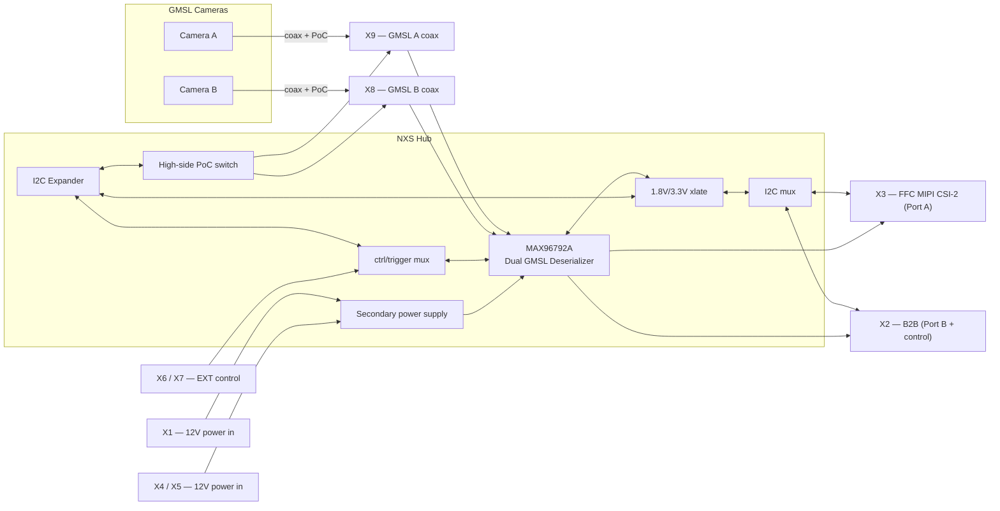
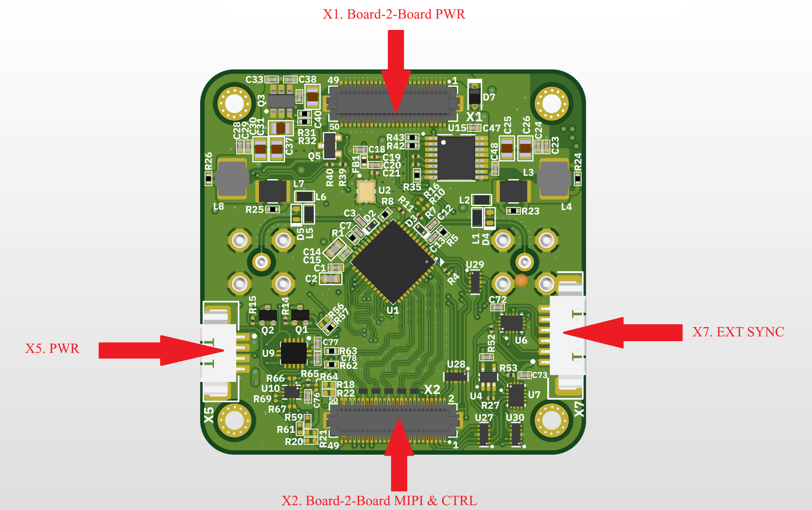
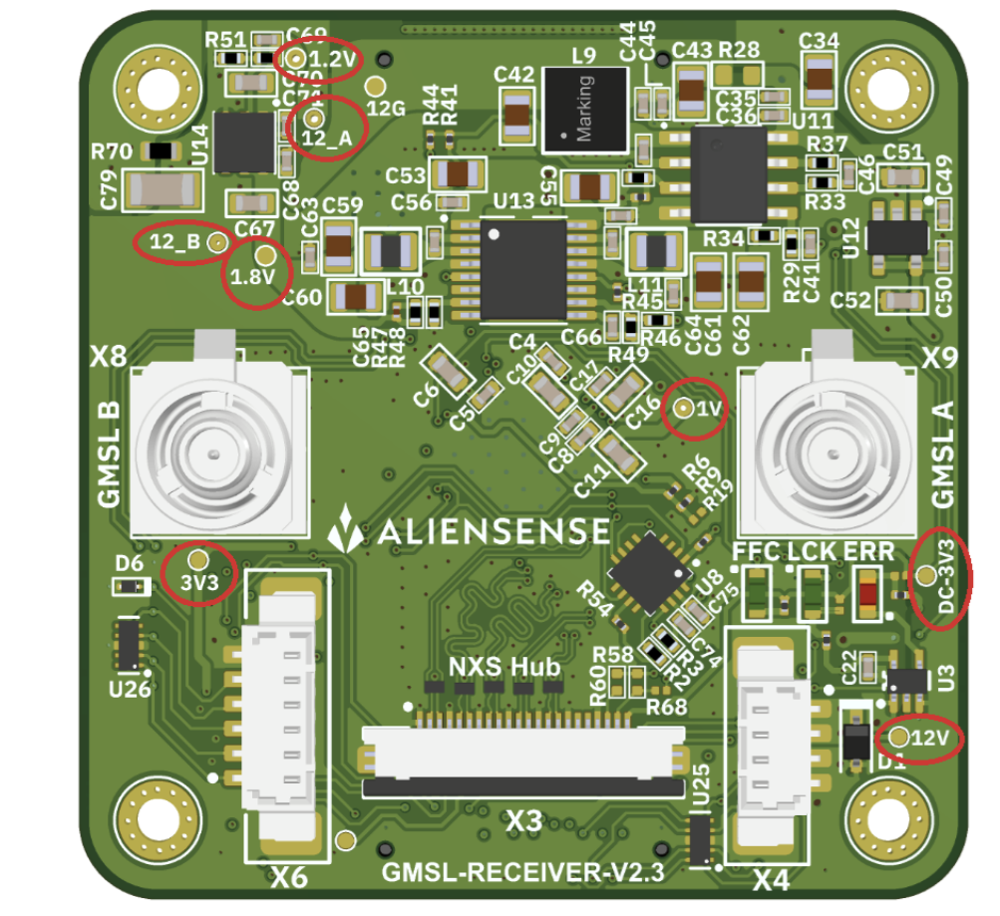
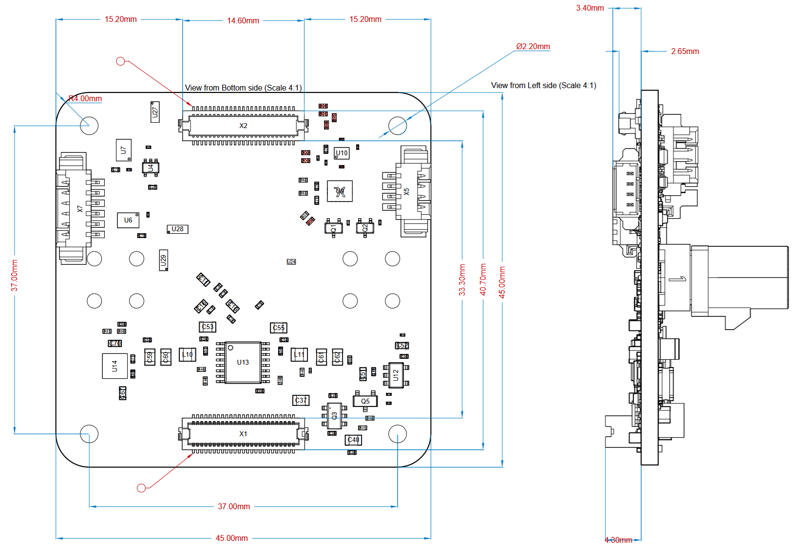
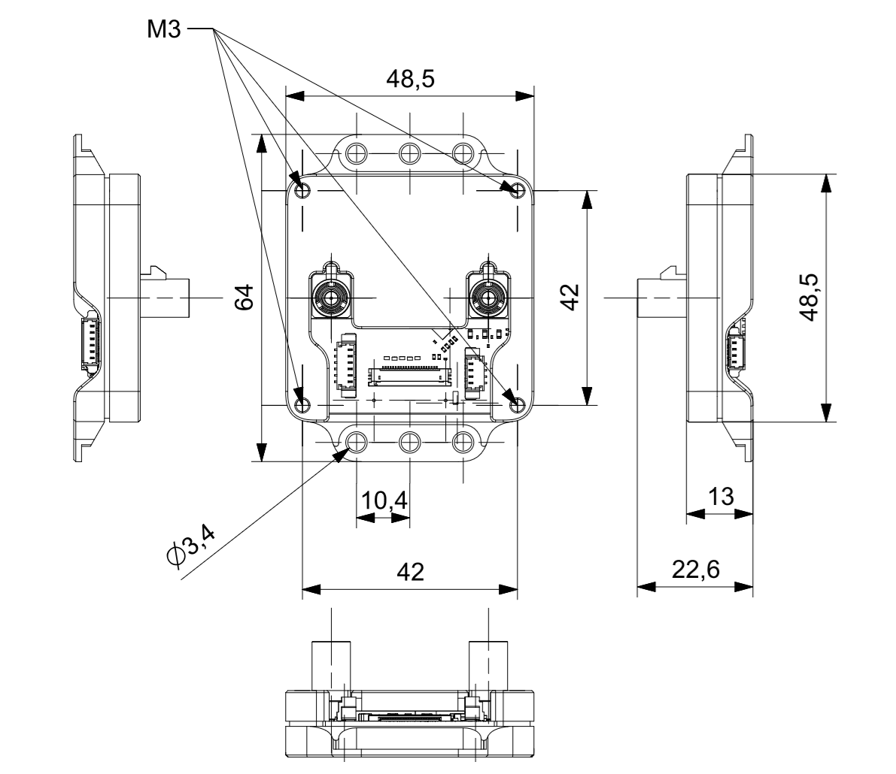

**Project:** NXS Hub
**Board:** GMSL RECEIVER
**Design revision:** V2.3
**Document date:** 2026-09-08
**Document version:** 1.1

***

## 1. Features

| Feature | Description |
|---|---|
| Dual GMSL3/2 deserialization | Two independent GMSL links → MIPI CSI-2 |
| MIPI CSI-2 output — Port A | 4-lane D-PHY, to FFC connector `X3` |
| MIPI CSI-2 output — Port B | 4-lane D-PHY, to board-to-board `X2` |
| Power-over-Coax (PoC) | Switched 12 V delivered to remote cameras over coax |
| Independent per-link power enable | GMSL A / GMSL B PoC individually switchable + protected |
| I²C level translation | 1.8 V core I²C ↔ 3.3 V system I²C, plus ERRB translation |
| I²C GPIO expander | Link enables, resets, PR\_EN, INT, config |
| Control / trigger source mux | Select MCU vs external control of RX/TX/XTRIG lines |
| I²C source mux | Select FFC-side vs MCU-side I²C master |
| Level shifting / logic | ERRB status logic, FFC reset buffering |
| ESD protection | All CSI-2 lanes, GMSL SIO, and exposed I/O |
| Status indication | 3 status/error LEDs (incl. LOCK and ERRB) |
| Bring-up / debug | 10 test points on key rails and nets |

***

## 2. Applications

* Embedded machine vision systems
* Robotics and autonomous platforms
* Multi-camera inspection systems
* Industrial vision integration platforms

***

## 3. Description

The **NXS Hub** is a dual-channel automotive camera aggregation / deserialization device.
It receives high-speed serialized video and bidirectional control data from up to
**two GMSL (Gigabit Multimedia Serial Link) camera modules** over coaxial cable, recovers
the video streams, and forwards them to a host processor as **MIPI CSI-2** data. The board
also provides **Power-over-Coax (PoC)** to feed the remote cameras through the same coax used
for data.

The core of the board is a **Analog Devices / Maxim `MAX96792A`** dual GMSL3/2
deserializer. It terminates two GMSL links (**Link A** and **Link B**) and maps their
received video onto two MIPI CSI-2 output controllers:

* **CSI Port A (CSIA):** 4 data lanes + 1 clock lane — routed to the FFC output connector `X3`.
* **CSI Port B (CSIB):** 4 data lanes + 1 clock lane — routed to the board-to-board connector `X2`.

Camera control and configuration are handled over **I²C** with automatic
**1.8 V ↔ 3.3 V level translation**, an **I²C GPIO expander** for link/power enables and
resets, and **signal multiplexers** that allow the deserializer's control and trigger lines
to be driven either by an on-carrier **MCU** or by an **external** header. Comprehensive
**ESD protection** is fitted on every high-speed and exposed interface.

**Primary signal flow:**

```
GMSL Camera A ──coax──► X9 ──► MAX96792A (Link A) ──► CSI Port A ──► X3 (FFC, MIPI CSI-2)
GMSL Camera B ──coax──► X8 ──► MAX96792A (Link B) ──► CSI Port B ──► X2 (board-to-board)
                                     ▲
                        I²C / control / reset / triggers
                       
```

**Power flow:**

```
12 V input (X1 / X4 / X5) ──► on-board regulators ──► 3.3 V, 1.8 V, 1.2 V, 1.0 V rails
                          └──► high-side switch (TPS2H160A-Q1) ──► PoC 12 V ──► X9 / X8 (coax)
```

**Block diagram:**



***

## 4. Absolute Maximum Ratings

> Values below are per the cited component datasheets. Stresses beyond these ratings may
> cause permanent damage. These are stress ratings only; functional operation is not implied.
> **Confirm against controlling datasheet revisions.**

| Parameter | Symbol | Min | Max | Unit |
|---|---|---:|---:|---:|
| 12 V power input | V(12V) | −0.3 | 20 | V |
| PoC output to coax | V(DC12\_GMSL) | −0.3 | 20\* | V |
| 3.3 V rail node | V(3V3) | −0.3 | 3.9 | V |
| 1.8 V rail node | V(1.8V) | −0.3 | 2.0 | V |
| 1.2 V rail node | V(1.2V) | −0.3 | 1.32 | V |
| 1.0 V rail node | V(1V) | −0.3 | 1.1 | V |
| MIPI CSI-2 lane pin | V(CSIx) | −0.3 | 1.32 | V |
| GMSL SIO pin | V(GMSL\_x\_SIO) | −0.3 | 2 | V |
| Operating junction temp | T\_J | — | 150 | °C |
| Storage temperature | T\_STG | −65 | 150 | °C |

## \*due to the system limitation

## 5. Recommended Operating Conditions

| Parameter | Symbol | Min | Typ | Max | Unit |
|---|---|---:|---:|---:|---|
| Main supply voltage | V(12V) | 4.7 | 12 | 17 | V |
| PoC output voltage | V(DC12\_GMSL) | — | 12 | — | V |
| 3.3 V rail | V(3V3) | 3.20 | 3.30 | 3.40 | V |
| 1.8 V rail | V(1.8V) | 1.75 | 1.80 | 1.85 | V |
| 1.2 V rail | V(1.2V) | 1.17 | 1.20 | 1.23 | V |
| 1.0 V rail | V(1V) | 0.97 | 1.00 | 1.03 | V |
| Reference clock | f(REF) | — | 25 | — | MHz |
| I²C bus speed | f(SCL) | — | 400 | — | kHz |
| I²C High Level Voltage | Vh\_I2C | — | 3.3 | — | V |
| GPIO High Level Voltage | Vh\_IO | — | 1.8 | — | V |
| Ambient operating temp | T\_A | −40 | +25 | +85 | °C |
| Operating PoC voltage range for GMSL video stream | V(12V) | 7 | 12 | 17 | V |

### 5.1 Power sequencing

:::caution
Make and break every connection cold. No power supply may be connected
to the NXS Hub or the host while the FFC, board-to-board, or coax
connections are handled — remove both supplies entirely. A supply that
is plugged into mains but switched off does not count as removed:
ground-potential differences and stored charge through a connected
supply are enough to destroy the host's CSI-2 inputs.
:::

Apply power in this order and remove it in the reverse order:

1. Power up the host (the MIPI CSI-2 receiver, e.g. a Jetson).
2. Power up the NXS Hub (12 V on X1 / X4 / X5).

Power down the NXS Hub first, the host last. A powered NXS Hub must never
be connected to an unpowered host: the CSI-2 and control lines would drive
the host's unpowered I/O and back-power it through the protection diodes.

***

## 6. Interface Descriptions

### 6.1 GMSL Camera Inputs (Link A / Link B)

* **Physical:** Two coaxial connectors — `X9` (GMSL A), `X8` (GMSL B), type `2FA1-NZSP-PCBB6`.
* **Function:** GMSL3/2 serial link carrying forward video + reverse control, with PoC.
* **Signals:** `GMSL_A_SIO_P` (X9), `GMSL_B_SIO_P` (X8), AC-coupled into `U1`.
* **Protection:** ESD + PoC filtering network per link.

### 6.2 MIPI CSI-2 Output — Port A (FFC)

:::caution
Use **same-side (Type A) FFC cables only** — also sold as Type 1 or
Type BD. An opposite-side cable (Type D / Type 2 / Type AD) mirrors
the pinout end for end and short-circuits the port and the host the
moment power is applied. The two types look identical at a glance:
check which side the contacts face at each end before connecting.
:::

* **Physical:** `X3`, 22+1 pos FFC/FPC (`0545482272`).
* **Cable:** same-side (Type A) FFC, 22 positions, 0.5 mm pitch.
* **Lanes:** `CSIA_CLK±`, `CSIA_D0±`…`CSIA_D3±` (4 data + 1 clock, D-PHY).
* **Sideband:** `FFC_SCL`, `FFC_SDA` (I²C), `FFC_RESET_B`, `DC_3V3` power out.
* **Role:** **Primary host video/data output.**

### 6.3 MIPI CSI-2 Output — Port B + System Control (Board-to-Board)

* **Physical:** `X2`, 50+1 pos DF12 board-to-board (`DF12NB-50DS-0.5V(51)`).
* **Lanes:** `CSIB_CLK±`, `CSIB_D0±`…`CSIB_D3±`.
* **Control:** deserializer RX/TX, resets, triggers (`DES_XTRIG0/1`), enables, MCU-side I²C
  (`MCU_SCL/SDA`), mux selects, `ERRB`, config straps.

### 6.4 Control / Configuration Bus (I²C)

* **System I²C (3.3 V):** `DESER_SCL_3V3` / `DESER_SDA_3V3`.

* **I²C mux :** selects between **FFC-side** (`FFC_SCL/SDA`) and **MCU-side**
  (`MCU_SCL/SDA`) masters via `MUX_I2C_SEL`.

* **I2C MUX Truth Table :**

| System Signal | MUX\_I2C\_SEL | Selected Source |
|---|---|---|
| DESERIALIZER I2C SDA | 0V | FFC\_SDA |
| DESERIALIZER I2C SDA | 1.8V | MCU\_SDA |
| DESERIALIZER I2C SCL | 0V | FFC\_SCL |
| DESERIALIZER I2C SCL | 1.8V | MCU\_SCL |

### 6.5 External Control Header

* **Physical:** `X6` (`0533980671`) and `X7` (`0532617006`), 6+1 pos.

* **Signals:** `EXT_XVS0/DES_RX1`, `EXT_DES_TX1`, `EXT_XHS0/DES_RX2`, `EXT_DES_TX2`,
  `EXT_XTRIG0`— routed through muxes (selected by `MUX1_SEL`, `MUX2_SEL`).

* **Reset/Sync Truth Table :**

| System Signal | MUX2\_SEL | Selected Source |
|---|---|---|
| DESERIALIZER RESET | 0V | FFC\_PIN\_17 |
| DESERIALIZER RESET | 1.8V | MCU\_RESET |
| DESERIALIZER XTRIG0 | 0V | EXT\_XTRIG0 |
| DESERIALIZER XTRIG0| 1.8V | MCU\_XTRIG0 |

### 6.6 Power Input

* **Physical:** `X1` (DF12 50+1), `X4` (`0533980471`), `X5` (`0532617004`).
* **Signal:** 12 V + GND.

***

## 7. Connector Descriptions and Pinouts

* **Fig.1: Connectors location, top**
  

>  
>  
>  

* **Fig.2: Connectors location, bottom**
  

>  
>  
>  

### 7.1 X1 — 12 V Power Input (Board-to-Board)

**Part:** `DF12NB(5.0)-50DP-0.5V(51)` · 50+1 positions
Odd pins = **12 V**, even pins = **GND**, pin 51 = **GND**. (Pins 1–50 alternate 12V/GND.)

| Pin | Net | Pin | Net |
|---:|---|---:|---|
| 1,3,5…49 (odd) | 12V | 2,4,6…50 (even) | GND |
| 51 | GND | | |

### 7.2 X2 — Board-to-Board (CSI Port B + Control)

**Part:** `DF12NB-50DS-0.5V(51)` · 50+1 positions

| Pin | Net | Pin | Net |
|---:|---|---:|---|
| 1 | MUX1\_SEL | 2 | DES\_XTRIG0 |
| 3 | MUX2\_SEL | 4 | DES\_XTRIG1 |
| 5 | MCU\_RESET | 6 | DES\_TX1 |
| 7 | MCU\_XTRIG0 | 8 | DES\_PWDNB |
| 9 | GND | 10 | XVS0/DES\_RX1 |
| 11 | DES\_RESET | 12 | MUX\_I2C\_SEL |
| 13 | PR\_EN\_0 | 14 | CSIB\_D3\_N |
| 15 | GND | 16 | GND |
| 17 | XHS0/DES\_RX2 | 18 | CSIB\_D3\_P |
| 19 | DES\_TX2 | 20 | CSIB\_D2\_N |
| 21 | GND | 22 | GND |
| 23 | MCU\_XHS0/DES\_RX2 | 24 | CSIB\_D2\_P |
| 25 | MCU\_DES\_TX1 | 26 | CSIB\_D1\_N |
| 27 | MCU\_DES\_TX2 | 28 | GND |
| 29 | MCU\_XVS0/DES\_RX1 | 30 | CSIB\_D1\_P |
| 31 | GMSL\_B\_EN | 32 | CSIB\_CLK\_N |
| 33 | GMSL\_A\_EN | 34 | GND |
| 35 | SYS\_EN | 36 | CSIB\_CLK\_P |
| 37 | MCU\_SDA | 38 | CSIB\_D0\_N |
| 39 | MCU\_SCL | 40 | GND |
| 41 | CFG1\_R | 42 | CSIB\_D0\_P |
| 43 | ERRB\_1V8 | 44 | reserved (factory configuration) |
| 45 | CFG0\_R | 46 | reserved (factory configuration) |
| 47 | reserved (factory configuration) | 48 | reserved (factory configuration) |
| 49 | reserved (factory configuration) | 50 | reserved (factory configuration) |
| 51 | GND | | |

### 7.3 X3 — FFC / MIPI CSI-2 Output (Port A) — *Primary Host Output*

**Part:** `0545482272` (Molex) · 22+1 positions
**Cable:** same-side (Type A) FFC only — see the §6.2 warning.

| Pin | Net | Description |
|---:|---|---|
| 1 | GND | Ground |
| 2 | CSIA\_D0\_N | CSI-2 Data 0 − |
| 3 | CSIA\_D0\_P | CSI-2 Data 0 + |
| 4 | GND | Ground |
| 5 | CSIA\_D1\_N | CSI-2 Data 1 − |
| 6 | CSIA\_D1\_P | CSI-2 Data 1 + |
| 7 | GND | Ground |
| 8 | CSIA\_CLK\_N | CSI-2 Clock − |
| 9 | CSIA\_CLK\_P | CSI-2 Clock + |
| 10 | GND | Ground |
| 11 | CSIA\_D2\_N | CSI-2 Data 2 − |
| 12 | CSIA\_D2\_P | CSI-2 Data 2 + |
| 13 | GND | Ground |
| 14 | CSIA\_D3\_N | CSI-2 Data 3 − |
| 15 | CSIA\_D3\_P | CSI-2 Data 3 + |
| 16 | GND | Ground |
| 17 | FFC\_RESET\_B | Reset (buffered) |
| 18 | NetTP10\_1 | Test/aux net (see TP10) |
| 19 | GND | Ground |
| 20 | FFC\_SCL | I²C clock |
| 21 | FFC\_SDA | I²C data |
| 22 | DC\_3V3 | 3.3 V power out |
| 23 | GND | Ground (shield/tab) |

### 7.4 X4 / X5 — 12 V Power Input

**Parts:** `X4` = `0533980471`, `X5` = `0532617004` (Molex) · 4+1 positions

| Pin | Net |
|---:|---|
| 1 | 12V |
| 2 | 12V |
| 3 | GND |
| 4 | GND |
| 5 | GND |

### 7.5 X6 / X7 — External Control Header

**Parts:** `X6` = `0533980671`, `X7` = `0532617006` (Molex) · 6+1 positions

| Pin | Net |
|---:|---|
| 1 | EXT\_XVS0/DES\_RX1 |
| 2 | EXT\_DES\_TX1 |
| 3 | EXT\_XHS0/DES\_RX2 |
| 4 | EXT\_DES\_TX2 |
| 5 | EXT\_XTRIG0 |
| 6 | GND |
| 7 | GND |

### 7.6 X8 / X9 — GMSL Coaxial Camera Inputs

**Part:** `2FA1-NZSP-PCBB6` · coax (signal + shield)

| Connector | Pin 1 (signal) | Pin 2 (shield) | Link |
|---|---|---|---|
| X9 | GMSL\_A\_SIO\_P | GND | GMSL A |
| X8 | GMSL\_B\_SIO\_P | GND | GMSL B |

***

## 8. Indicators and Test Points

### 8.1 Status LEDs

| Ref | COLOR | Function (from net context) |
|---|---|---|
| LED1 | GREEN | Status (FFC cable connected) |
| LED2 | GREEN | Status (GMSL Link Locked) |
| LED3 | RED | Error / ERRB (GMSL Link Error) |

**Fig.3: LED location**


>  
>  
>  

### 8.2 Test Points

| Ref | Net / Label |
|---|---|
| TP1 | DC-3V3 |
| TP2 | 12V |
| TP3 | 12G (12 V ground/return) |
| TP4 | 12\_A (GMSL A PoC) |
| TP5 | 12\_B (GMSL B PoC) |
| TP6 | 3V3 |
| TP7 | 1.8V |
| TP8 | 1V |
| TP9 | 1.2V |
| TP10 | NetTP10\_1 (aux, also on X3.18) |

**Fig.4: Test points location**


>  
>  
>  

***

## 9. Mechanical Information

**Fig.5: GMSL Receiver board dimensions**


>  
>  
>  

**Fig.6: NXS Hub Dimensions**


>  
>  
>  

***

## 10. Cautionary Statement

Never hot-plug the camera or host connections. Cabling happens with both
power supplies removed (§5.1), and power follows the §5.1 sequence — host
up first, NXS Hub down first. The FFC output takes same-side (Type A)
cables only (§6.2).

## Safety instructions: see the *Important Safety Instructions* document on the product page.

## 11. Support

* Technical support: support@aliensense.com
* Documentation & downloads: product documentation and datasheets on the product page
* Aliensense · [aliensense.com](https://aliensense.com)

***
