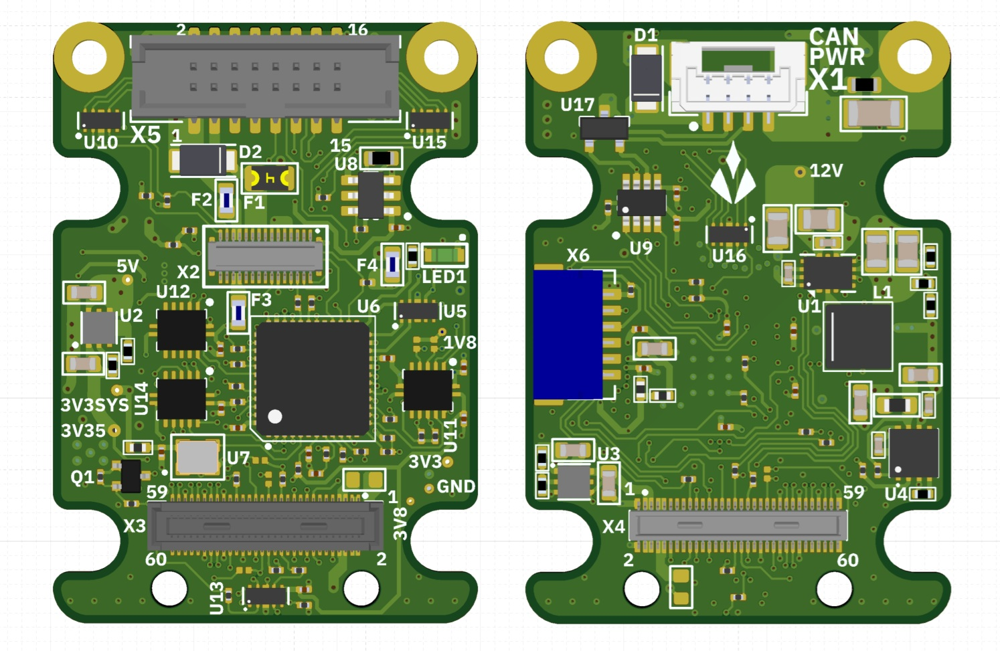

import { CardGrid, LinkCard } from '@astrojs/starlight/components';

Documentation for the Aliensense NXS sensor platform: the NXS sensor
co-processor module and the NXS Hub camera interface. The set
covers quick starts, datasheets, product specifications, and the released
integration documents, and is published from the firmware repository at
every release.

New to NXS? Start with [Getting Started](getting-started/overview/) —
install the host tool and make first contact with a unit in three
commands. The first hour with the hardware is the [guide set](guides/):
from a fresh Jetson to a dual camera, seven chapters, one path each.

  <article class="product-card">
    ### Aliensense NXS

    

      
    

    

      The **NXS sensor co-processor** connects mikroBUS Click sensors and MIPI
      cameras to a host over **GMSL coax or CAN-FD**. Patches are uploaded at
      runtime and measurements arrive in **SI units, self-described on the
      wire**. See the [product description](hardware/product-description/) for
      the details.
    

  </article>

  <article class="product-card">
    ### NXS Hub

    

      
    

    

      The **NXS Hub** bridges **two GMSL camera inputs** into a host-friendly
      **MIPI CSI-2** environment — deserialization, power management, control,
      and protection in one module. See the
      [Hub overview](hub/product-description/) for the details.
    

  </article>

## Documentation sections

<CardGrid>
  <LinkCard title="Getting started" href="getting-started/overview/">
    Install the host tool, probe the unit, upload a patch, stream SI
    samples.
  </LinkCard>

  <LinkCard title="Guides" href="guides/">
    From a fresh Jetson to a dual camera: seven chapters, one path
    each, every command with the output it prints.
  </LinkCard>

  <LinkCard title="NXS datasheet" href="hardware/datasheet/">
    Connectors, pinout, electrical ratings, and mechanical drawings.
  </LinkCard>

  <LinkCard title="NXS Hub datasheet" href="hub/datasheet/">
    Ratings, interfaces, connectors and pinouts, mechanical.
  </LinkCard>

  <LinkCard title="Reference" href="reference/">
    The released set — specifications and the integration
    documents.
  </LinkCard>
</CardGrid>

## About Aliensense

Aliensense builds sensing infrastructure for robotics. The NXS platform
moves the sensor-integration work — hardware interface, driver layer,
data transport — onto the module itself, so sensors and cameras placed
anywhere on a machine arrive at the compute node as decoded SI-unit
data. This documentation set is published from the firmware repository
at each release and matches the firmware it ships with.
